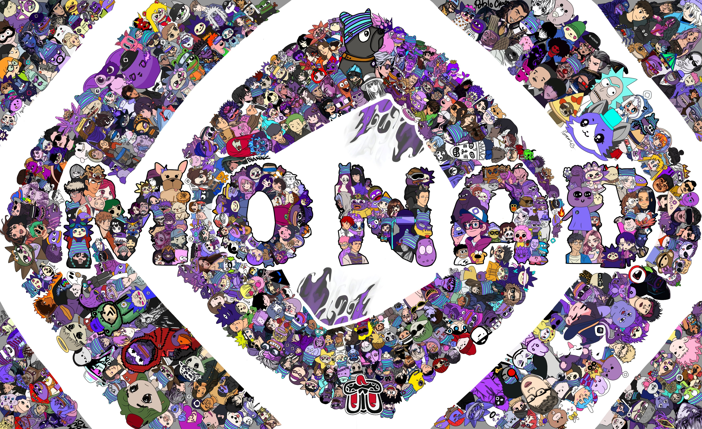

## Hi World! I'm mjfendin👋

<!--
**mjfendin/mjfendin** is a ✨ _special_ ✨ repository because its `README.md` (this file) appears on your GitHub profile.

Here are some ideas to get you started:

- 🔭 I’m currently working on ...
- 🌱 I’m currently learning ...
- 👯 I’m looking to collaborate on ...
- 🤔 I’m looking for help with ...
- 💬 Ask me about ...
- 📫 How to reach me: ...
- 😄 Pronouns: ...
- ⚡ Fun fact: ...
-->

- 🔭 I'm currently working on creating a monad game in farcade (warpcast/farcaster)

##### Skills :
    

##### Connect With me :
  

##### OS :
   

##### Office:
      

##### 📊My Github Stats :

 